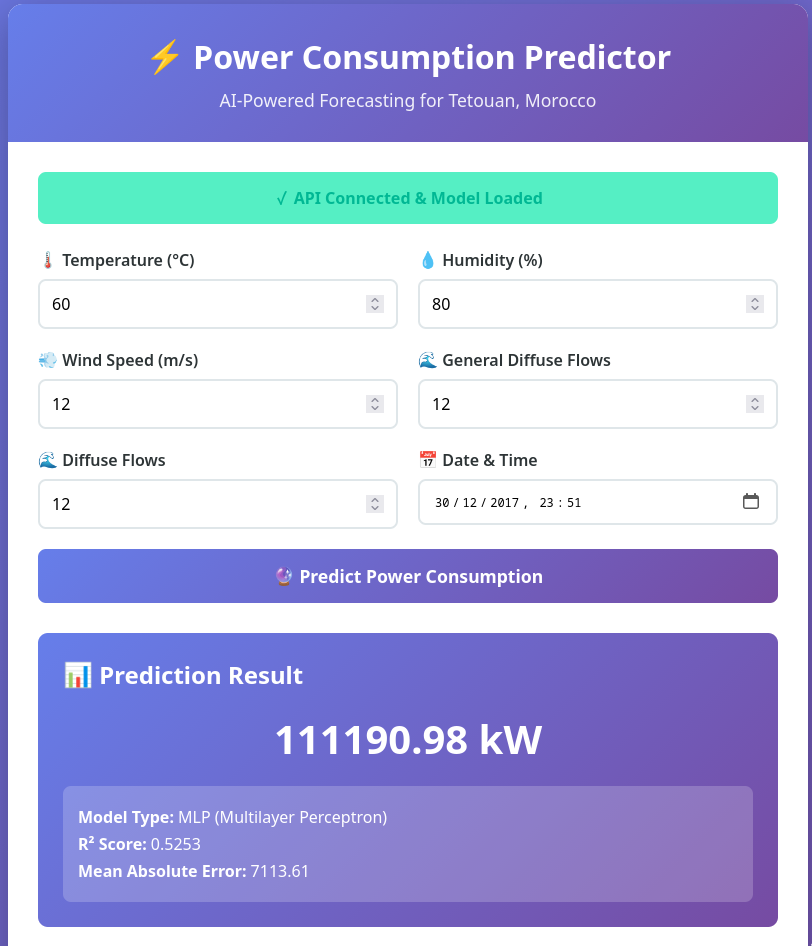

# AI Essentials: Final Project

Power consumption prediction system for Tetouan, Morocco using machine learning. This project implements a Multilayer Perceptron (MLP) neural network to forecast electricity consumption based on weather conditions and temporal features.

## Table of Contents

- [AI Essentials: Final Project](#ai-essentials-final-project)
  - [Table of Contents](#table-of-contents)
  - [Overview](#overview)
  - [Prerequisites](#prerequisites)
  - [Installation](#installation)
  - [Dataset](#dataset)
    - [Source](#source)
    - [Description](#description)
    - [Dataset Columns](#dataset-columns)
    - [Dataset Context](#dataset-context)
  - [Model](#model)
    - [Architecture](#architecture)
    - [Features](#features)
    - [Performance Metrics](#performance-metrics)
  - [Training](#training)
    - [Using Jupyter Notebook](#using-jupyter-notebook)
    - [Model Outputs](#model-outputs)
  - [Web Application](#web-application)
    - [Screenshot](#screenshot)
    - [Quick Start](#quick-start)
  - [Project Structure](#project-structure)
  - [Usage Examples](#usage-examples)
    - [Using the Web Interface](#using-the-web-interface)
  - [Notes](#notes)

## Overview

This project predicts total power consumption in Tetouan, Morocco by analyzing:
- **Weather features**: Temperature, Humidity, Wind Speed, General Diffuse Flows, Diffuse Flows
- **Temporal features**: Hour, Day of Week, Month, Day of Year (with cyclical encoding)

The model uses a deep neural network (MLP) architecture to learn patterns from historical consumption data collected from the SCADA system of Amendis, the public service operator responsible for electricity distribution in Tetouan.

## Prerequisites

- **Python**: 3.13 or higher
- **uv**: Python package manager ([installation guide](https://github.com/astral-sh/uv))

## Installation

1. Clone the repository (if applicable):
```bash
git clone <repository-url>
cd 5_Final_Project
```

2. Install dependencies using `uv`:
```bash
uv sync
```

This will install all required packages including:
- PyTorch (for neural network training)
- FastAPI & Uvicorn (for web API)
- NumPy, Pandas (for data processing)
- Scikit-learn (for preprocessing)
- Matplotlib, Seaborn (for visualization)
- Jupyter (for notebook execution)

## Dataset

### Source
The dataset is from [Kaggle: Electric Power Consumption](https://www.kaggle.com/datasets/fedesoriano/electric-power-consumption)

### Description
- **Location**: Tetouan, Morocco
- **Records**: 52,416 observations
- **Time Window**: 10-minute intervals
- **Features**: 9 columns (datetime + 5 weather features + 3 zone consumption values)

### Dataset Columns
- `Datetime`: Time window of ten minutes
- `Temperature`: Weather temperature (°C)
- `Humidity`: Weather humidity (%)
- `WindSpeed`: Wind speed
- `GeneralDiffuseFlows`: General diffuse flows
- `DiffuseFlows`: Diffuse flows
- `PowerConsumption_Zone1`: Power consumption for Zone 1 (Quads)
- `PowerConsumption_Zone2`: Power consumption for Zone 2 (Smir)
- `PowerConsumption_Zone3`: Power consumption for Zone 3 (Boussafou)

### Dataset Context
Tetouan is a city in northern Morocco with a population of approximately 550,374 inhabitants (2014 census). The electricity distribution network is powered by 3 zone stations: Quads, Smir, and Boussafou. The data was collected from the SCADA system of Amendis, which has been responsible for electricity distribution since 2002.

For more details, see [`data/info.md`](data/info.md).

## Model

### Architecture
- **Type**: Multilayer Perceptron (MLP) Regressor
- **Input Size**: 12 features
- **Hidden Layers**: [256, 128, 64, 32] neurons
- **Dropout Rate**: 0.3
- **Activation**: ReLU
- **Normalization**: BatchNorm1d after each hidden layer
- **Output**: Single value (total power consumption)

### Features
The model uses 12 engineered features:
1. Temperature
2. Humidity
3. WindSpeed
4. GeneralDiffuseFlows
5. DiffuseFlows
6. Hour_sin (cyclical encoding)
7. Hour_cos (cyclical encoding)
8. DayOfWeek_sin (cyclical encoding)
9. DayOfWeek_cos (cyclical encoding)
10. Month_sin (cyclical encoding)
11. Month_cos (cyclical encoding)
12. DayOfYear

### Performance Metrics
- **R² Score**: 0.5253
- **MAE**: 7,113.61
- **RMSE**: 9,812.07
- **MAPE**: 10.11%

## Training

### Using Jupyter Notebook

1. Open `main.ipynb` and run all cells

The notebook includes:
- Data loading and exploration
- Feature engineering (temporal feature extraction)
- Data preprocessing (scaling)
- Model training with PyTorch
- Model evaluation
- Model saving to `output/mlp/`

### Model Outputs
After training, the following files are saved in `output/mlp/`:
- `mlp_model_complete.pth`: Complete trained model
- `mlp_model.pth`: Model state dict
- `scaler_X.pkl`: Feature scaler
- `scaler_y.pkl`: Target scaler
- `model_config.json`: Model configuration and metrics
- `feature_names.txt`: Feature names

## Web Application

A FastAPI-based web application provides an interactive interface and REST API for making predictions.

### Screenshot



### Quick Start

1. Navigate to the web directory:
```bash
cd web
```

2. Start the server:
```bash
python main.py
```

The API will be available at:
- **Web Interface**: http://localhost:8000
- **Interactive API Docs (Swagger)**: http://localhost:8000/docs
- **Alternative Docs (ReDoc)**: http://localhost:8000/redoc

## Project Structure

```
5_Final_Project/
├── data/
│   ├── info.md                    # Dataset information
│   └── powerconsumption.csv       # Dataset file
├── output/
│   └── mlp/                       # Trained model files
│       ├── mlp_model_complete.pth
│       ├── mlp_model.pth
│       ├── scaler_X.pkl
│       ├── scaler_y.pkl
│       ├── model_config.json
│       └── feature_names.txt
├── web/
│   ├── main.py                    # FastAPI application
│   ├── index.html                 # Web interface
│   ├── test_api.py                # API test script
│   ├── README.md                  # Web app documentation
│   └── QUICKSTART.md              # Quick start guide
├── main.py                        # Simple entry point
├── main.ipynb                     # Jupyter notebook for training
├── pyproject.toml                 # Project dependencies
├── uv.lock                        # Lock file
└── README.md                      # This file
```

## Usage Examples

### Using the Web Interface

1. Start the web application (see [Web Application](#web-application) section)
2. Navigate to http://localhost:8000 in your browser
3. Fill in the form with weather conditions and datetime
4. Click "Predict" to get the power consumption forecast

The web interface provides an intuitive way to make predictions without needing to write code or use command-line tools.

## Notes

- The model files must be present in `output/mlp/` before running the web application
- Ensure you've trained the model using `main.ipynb` before using the API
- The web application automatically loads the model on startup
- All predictions use the trained model with no gradient computation for efficiency

